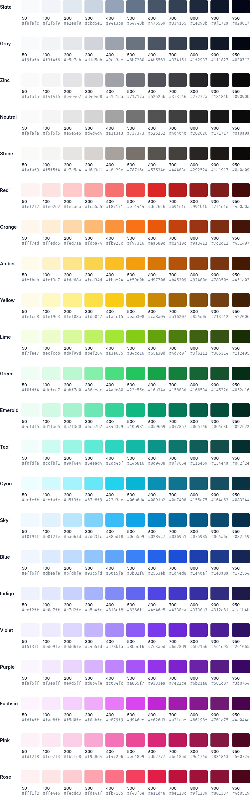

# Tailwind-Colour-Palette
Inkscape / GIMP colour palette based on Tailwind CSS colours

It is a .gpl file which you can use with Inkscape and GIMP to get Tailwind CSS' offical colours as provided in the link below

Source : https://tailwindcss.com/docs/customizing-colors 

  

